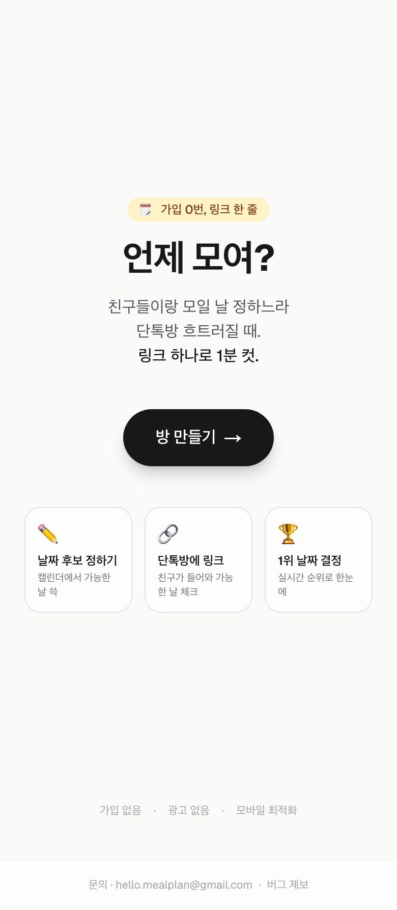
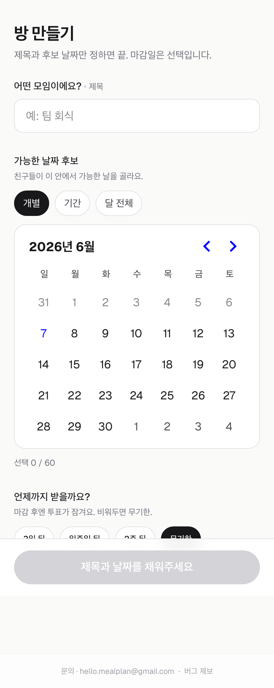
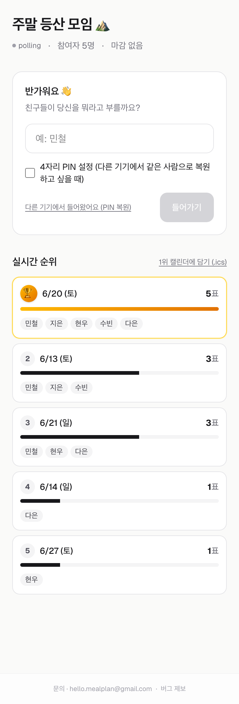
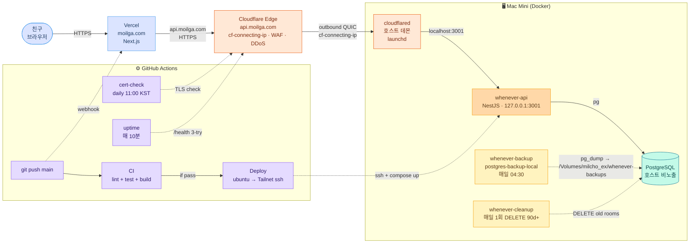

# 언제모여 (daypoll)

> 친구들이랑 모일 날짜, 회원가입 없이 링크 하나로 정해요.

**라이브**: [https://moilga.com](https://moilga.com)

[](https://github.com/milcho0604/daypoll/actions/workflows/ci.yml)
[](https://github.com/milcho0604/daypoll/actions/workflows/deploy.yml)

---

## 왜 만들었나

단톡방에서 "난 15일 돼" "난 그날 안 돼" 식으로 흩어지는 모임 일정을, 링크 하나로 1분 컷.
when2meet 처럼 시간대까지 잡지 않고 **날짜만** — 가장 가벼운 케이스에 집중.

- ✅ **가입 0번** — 닉네임만 입력
- ✅ **링크 하나** — 단톡방 / QR / 카톡용 문구 자동 생성
- ✅ **모바일 우선** — 캘린더에서 드래그로 여러 날 한 번에 토글
- ✅ **실시간** — 친구가 투표하면 화면에 즉시 반영
- ✅ **마감 D-day** — 임박하면 빨갛게 강조

## 스크린샷

| 메인 | 방 생성 |
|---|---|
|  |  |
| 링크 발급 (QR + 카톡 문구) | 방 화면 (🏆 amber + 실시간 순위) |
|  |  |

> _스크린샷은 [라이브 사이트](https://moilga.com) 모바일 뷰포트(390×844)에서 자동 캡쳐 (`playwright`)._

---

## 사용 흐름

```
1. /rooms/new        제목 + 후보 날짜(개별/기간/달 전체) + 마감일 프리셋 → 만들기
2. /rooms/[id]/created   QR 코드 + "🔗 링크" + "💬 카톡용 문구" + 📤 공유
3. 친구가 링크 클릭 → 닉네임 → 캘린더에서 가능한 날 드래그 토글
4. /rooms/[id]       실시간 순위(🏆 + amber 그라데이션), 마감 D-day, 1위 .ics 다운로드
```

## 기능 한눈에

| | |
|---|---|
| **방 생성** | 후보 날짜 — 캘린더 한 화면에서 `개별 / 기간 / 달 전체` 3가지 모드. 마감일 프리셋 (3일/일주일/2주/무기한). **"내 닉네임" 선택 입력** → 방 화면에 `by 진솔` 표시 |
| **공유** | QR 코드, 카톡용 문구 자동 생성 ("우리 언제 모일까? 1분 컷"), Web Share API |
| **참여** | 닉네임만 — 이전 방에서 쓴 닉네임 자동 채움. **같은 닉네임 자동 차별화** (`지수 → 지수 (2)`). PIN 옵션(다른 기기에서 복원) |
| **투표** | 캘린더 드래그 + **빠른 선택 칩** (주말만 / 평일만 / 다 가능 / 초기화) |
| **자동 복원** | 같은 브라우저 재방문 → PIN 없이도 자동. 다른 기기는 **PIN 만 입력** (닉네임 없이) → 같은 PIN 충돌 시에만 닉네임 fallback |
| **결과** | 실시간 순위표 (날짜별 ⇄ 사람별 토글), 1위 🏆 그라데이션, 동률 1위 공동 표시, Socket.IO + 폴링 fallback |
| **마감** | D-day 표시, D-1 이내 rose 강조, 마감 후 잠금. 개설자는 언제든 수정/재개 |
| **결과 활용** | 1위 날짜 `.ics` 다운로드, **결과 이미지 저장** (OG 카드 PNG — 단톡방 캡쳐 공유), OG 카드 자동 생성 |
| **개설자** | `⚙️ 방 관리` 칩 한 개 → 모달에서 마감일 수정 / 지금 종료 통합. **PIN 으로 다른 기기에서도 권한 회수 가능** (creator_participant_id link). 참여자 강퇴, 링크 재공유 |
| **어드민** | KPI · 일별 추이 · 요일별 / 시간대별 · Top 5 · 활동 피드(LIVE) · CSV 내보내기 (formula injection 방어) · 액션 로그 |
| **공유 카드** | 메인·방 모두 OG 이미지 자동 생성 (1200×630 amber 톤). 카톡/슬랙/트위터 미리보기 |
| **PWA** | `manifest.webmanifest` + 자체 아이콘 (amber 그라데이션 + "모"). 홈 화면 추가 시 standalone 앱 |
| **에러 페이지** | `not-found.tsx` / `error.tsx` / `global-error.tsx` 한국어 친근체 — 영어 기본 페이지 노출 X |
| **a11y** | focus ring (amber-400/40), aria-live (저장/에러 메시지), **`prefers-reduced-motion` 존중** (애니메이션 자동 끔) |
| **약관** | `/privacy` (개인정보처리방침, PIPA 준수) · `/terms` (이용약관). 글로벌 footer 에서 진입 |
| **보안** | timingSafeEqual / secureEquals 비교, IP rate limit + 방-닉네임 PIN lockout 5회/30분, CORS 화이트리스트, scrypt PIN 해싱, 어드민 토큰 가드, X-Frame-Options DENY · Referrer-Policy · Permissions-Policy · HSTS · X-Content-Type 헤더, ILIKE 와일드카드 escape, **컨테이너 USER node + cap_drop ALL + no-new-privileges** |
| **트래픽 통계** | Vercel Analytics (쿠키리스 · PII 미수집) |
| **에러 추적** | Sentry SDK 코드 내장 (`@sentry/node` + `@sentry/nextjs`) — DSN 환경변수 없으면 자동 no-op. 본격 트래픽 시 DSN 등록 5분 |
| **운영** | 매일 04:30 DB 백업 (14일/4주 rotation, Docker 컨테이너 자동), 매일 90일 지난 방 정리 (Docker 컨테이너 자동), TLS/auth-key 만료 자동 알림, 10분 간격 uptime 모니터 |

---

## 기술 스택

| 영역 | 선택 | 이유 |
|---|---|---|
| 프론트 | **Next.js 16 (App Router) + Tailwind v4** | Vercel 자동 배포, RSC, Turbopack 빠름 |
| 백엔드 | **NestJS 11 + raw `pg`** | 회사 스택과 동일, 모듈/가드/DI 패턴 익숙, 스키마 단순(4테이블)이라 ORM 불필요 |
| DB | **PostgreSQL 16 (Docker)** | 데이터 통제 + 비용 0 |
| 실시간 | **Socket.IO** (방·어드민 채널) + 폴링 fallback | Cloudflare Tunnel 호환 |
| 차트 | **recharts** | 가볍고 SSR 친화 |
| 캘린더 | **react-day-picker v10** | 다중/범위/단일 모드, 커스텀 DayButton 가능 |
| QR | **qrcode** | 가벼움 (5KB) |
| 모노레포 | **pnpm workspace** | shared 패키지(`@whenever/shared`) 타입 공유 |
| 호스팅 | **맥미니 Docker + Cloudflare Tunnel + Vercel** | $0/월 (도메인만 $11.25/년) · 실 IP 보존 · DDoS 흡수 |
| 분석 | **Vercel Analytics** | 쿠키리스 · PII 미수집 · privacy-friendly |
| CI/CD | **GitHub Actions** (CI · Deploy · Cert-Check · Uptime) | 자동 lint·test·deploy·만료 알림·헬스 모니터 |

## 아키텍처



> Tailscale 도 살아있지만 deploy.yml 의 ephemeral ssh 용으로만 사용 — Funnel 은 끔.

자세한 배포 가이드: [`deploy/README.md`](deploy/README.md)

---

## 로컬 셋업

```bash
git clone https://github.com/milcho0604/daypoll.git
cd daypoll
pnpm install

# DB 띄우기 (Docker)
docker compose up -d
# .env 작성
cp apps/api/.env.example apps/api/.env   # 또는 직접 작성

# 마이그레이션
pnpm --filter @whenever/api migrate

# dev (api + web 같이)
pnpm --filter @whenever/api dev   # :3001
pnpm --filter @whenever/web dev   # :3000

# 테스트
pnpm --filter @whenever/api test          # unit
pnpm --filter @whenever/api test:e2e      # 50 케이스, 별도 test DB
```

## 폴더 구조

```
apps/
  api/      NestJS 백엔드
    src/
      admin/         어드민 모듈 (stats/list/csv/logs)
      rooms/         방 생성·조회·마감·.ics
      participants/  입장·투표·강퇴·PIN 복원
      realtime/      Socket.IO 게이트웨이 (방 + 어드민 채널)
      common/        rate-limit, secure-compare, client-ip, db helpers
    db/migrations/   0001~0003 SQL
    test/            e2e (50 케이스, --runInBand)
  web/      Next.js 프론트
    src/
      app/           라우트 (App Router)
        rooms/[id]/  방 화면 + opengraph-image
        admin/       어드민 대시보드/목록/상세/로그
      components/    date-builder, date-availability-picker, empty-state
      lib/           api, rooms, admin, socket, tokens

packages/
  shared/   타입 공유

deploy/     맥미니 배포 + 운영 가이드 (cloudflared, compose)
.github/workflows/  CI · Deploy · Cert-check
```

---

## API 요약

| Method | Path | 설명 |
|---|---|---|
| `POST` | `/rooms` | 방 생성 (제목·후보 날짜·마감일) |
| `GET` | `/rooms/:id` | 방 정보 + 후보 + 집계 |
| `GET` | `/rooms/:id/results` | 집계만 (폴링용) |
| `GET` | `/rooms/:id/winner.ics` | 1위 날짜 캘린더 (.ics) |
| `PATCH` | `/rooms/:id/deadline` | 마감일 수정 (creator_token) |
| `POST` | `/rooms/:id/participants` | 입장 (닉네임, 선택 PIN) |
| `PUT` | `/rooms/:id/participants/me/availabilities` | 본인 가능 날짜 갱신 (client_token) |
| `POST` | `/rooms/:id/participants/recover` | PIN 으로 복원 |
| `DELETE` | `/rooms/:id/participants/:pid` | 강퇴 (creator_token) |
| `GET` | `/health` | 헬스 (DB 도달성 포함) |

**어드민** (`x-admin-token` 헤더):
| Method | Path | 설명 |
|---|---|---|
| `GET` | `/admin/stats` | KPI + 일별 추이 + 요일별 + 시간대별 + Top 5 + 최근 액션 |
| `GET` | `/admin/rooms` | 방 목록 (검색·정렬·페이지) |
| `GET` | `/admin/rooms/:id` | 방 상세 (참여자 + 득표) |
| `PATCH` | `/admin/rooms/:id/deadline` | 마감 수정 |
| `DELETE` | `/admin/rooms/:id/participants/:pid` | 강퇴 |
| `DELETE` | `/admin/rooms/:id` | 방 삭제 |
| `GET` | `/admin/rooms.csv` / `/admin/rooms/:id/export.csv` | CSV |
| `GET` | `/admin/logs` | 어드민 액션 시계열 |
| `POST` | `/admin/cleanup` | 오래된 방 일괄 정리 |

---

## 운영 자동화

| 워크플로 | 트리거 | 동작 |
|---|---|---|
| `ci.yml` | 모든 push / PR | lint + unit + e2e + build |
| `deploy.yml` | main 의 백엔드 변경 push | ubuntu → Tailscale → mac mini ssh → `docker-compose up -d --build` (45초) |
| `cert-check.yml` | 매일 11:00 KST | TLS · Tailscale auth key 잔여일 점검 → 30일 이내면 GitHub Issue 자동 |
| `uptime.yml` | 매 10분 | `/health` 3 회 retry → 다운 시 GitHub Issue 자동 (메일 푸시), 복귀 시 자동 close |
| launchd `cloudflared` | 부팅 시 + 항상 가동 | 백엔드 외부 노출 — Cloudflare Edge → 호스트 → `localhost:3001`. 끊기면 자동 재연결 |
| Docker `whenever-backup` | 매일 04:30 (컨테이너 cron) | `pg_dump` → `/Volumes/milcho_ex/whenever-backups/{daily,weekly,monthly,last}/`. 14일/4주 rotation. `prodrigestivill/postgres-backup-local:16` |
| Docker `whenever-cleanup` | 매일 1회 (sleep 86400) | 90일 지난 `rooms` CASCADE DELETE. `postgres:16-alpine` + `psql` |

자동화 흐름 전체: [`deploy/README.md`](deploy/README.md)

---

## 문의 · 버그 제보

- 일반 문의 : [hello.mealplan@gmail.com](mailto:hello.mealplan@gmail.com)
- 버그 / 기능 제안 : [GitHub Issues](https://github.com/milcho0604/daypoll/issues/new)

---

## 라이센스

개인 프로젝트 · MIT
