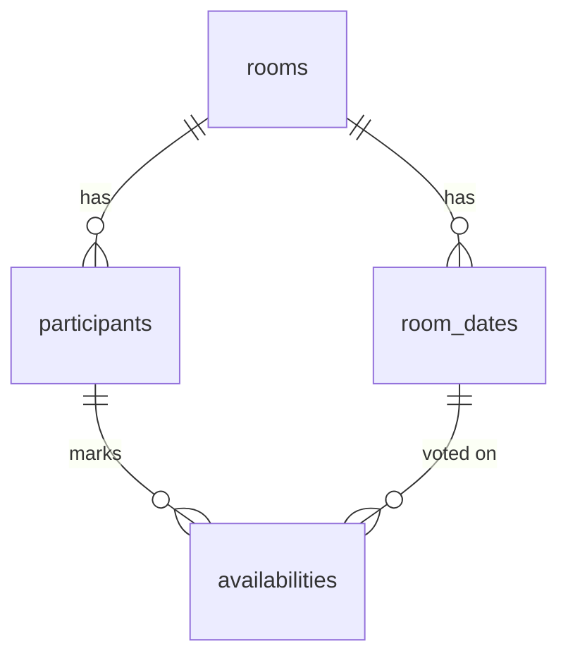

# (가칭) 언제모여 — 날짜 맞추기 앱 기획서

> 친구들끼리 모일 날짜를, 회원가입 없이 링크 하나로 투표해서 정하는 웹앱

---

## 1. 배경 / 문제 정의

여러 명이 모일 날짜를 잡을 때, 단톡방에서 "난 15일 돼" "난 그날 안 돼" 식으로 말이 흩어지면 누가 언제 되는지 한눈에 안 보인다. 인원이 많을수록 심해진다.

기존 서비스(when2meet, ndays 등)가 이 문제를 풀지만, 시간대 격자까지 잡는 게 보통이라 "그냥 날짜만 맞추고 싶다"는 가벼운 케이스엔 과하다. 또 일부는 가입을 요구한다.

**이 앱의 포지션:** 회원가입 없음 + 시간대 없이 날짜 단위 + 링크 하나로 끝나는, 가장 가벼운 날짜 투표 도구.

---

## 2. 핵심 원칙

1. **무가입** — 이메일/비밀번호 없음. 링크 + 닉네임이 전부.
2. **날짜 단위** — 시간대(오전/오후/시각)는 다루지 않는다. 후보 날짜에 대해 가능/불가만 표시.
3. **단순 집계** — 가장 많이 겹치는 날부터 1등, 2등 … 순위로 보여준다 (선호 순위 매기기 아님).
4. **실시간 반영** — 누가 투표하면 같은 방을 보고 있는 사람 화면에 곧바로 반영.
5. **모바일 우선** — 링크를 단톡방에서 받아 폰으로 여는 경우가 대부분. 모바일을 기준으로 설계하고 데스크탑으로 확장한다.

---

## 3. 핵심 기능 (MVP 범위)

| 기능 | 설명 |
|---|---|
| 방 생성 | 제목 + 후보 날짜들을 선택해서 방을 만든다. 생성 시 고유 링크가 발급된다. |
| 링크 입장 | 링크를 받은 사람은 별도 입력 없이 그 방으로 들어온다. |
| 닉네임 입장 | 방에 처음 들어오면 닉네임을 입력한다. (key 입력창 대신) |
| 날짜 투표 | 후보 날짜들 중 본인이 가능한 날을 모두 체크한다. |
| 본인 표 수정 | 다시 들어오면 자기가 찍은 표가 그대로 보이고 수정 가능. |
| 실시간 집계 | 날짜별 득표를 모아 1등~N등 순위로 표시. 다른 사람 투표가 즉시 반영. |
| 투표 마감 | 개설자가 마감일을 설정(선택). 마감 후 투표 잠금. 개설자는 마감일을 언제든 수정 가능. 마감일 미설정 시 무기한. |

### MVP에서 빼는 것 (후순위)
- 시간대 선택
- 선호 순위(1~5위 가중치) 투표
- 댓글/채팅
- 푸시 알림 / 마감 임박 알림
- 개설자 전용 관리 기능(참여자 강퇴 등)

---

## 4. 사용자 플로우

### 4-1. 개설자
```
1. 메인 → "방 만들기"
2. 제목 입력 (예: "5월 동기 모임")
3. 후보 날짜 선택 (캘린더에서 4~5월 중 가능 후보를 여러 개 찍음)
4. 마감일 설정 (선택 — 안 정하면 무기한)
5. "만들기" → 방 생성 + 링크 발급
6. 링크 복사해서 단톡방에 공유
7. 본인도 닉네임 넣고 자기 가능 날짜 투표
8. (언제든) 마감일 수정 — 미루기 / 당기기 / 무기한으로 풀기
```

### 4-2. 참여자
```
1. 링크 클릭 → 방 진입
2. (처음이면) 닉네임 입력
3. 후보 날짜 중 가능한 날 체크 → 저장
4. 실시간 순위표에서 현재 1등 날짜 + 마감 D-day 확인
5. 나중에 같은 링크로 재진입 → 본인 표 자동 인식 → 수정 가능
6. 마감 후 재진입 시 → 투표 비활성, 결과만 확인
```

---

## 5. 유저 식별 전략 (무가입 핵심)

가입이 없으니 "이 사람이 아까 그 사람"을 어떻게 알아보느냐가 관건이다.

- 방 입장 시 닉네임을 받고, 백엔드는 그 참여자에게 **고유 토큰(`client_token`)**을 발급한다.
- 이 토큰을 **브라우저 localStorage**에 저장한다 (`room_<roomId>` 키로 방마다 분리).
- 같은 링크에 재진입하면 localStorage의 토큰을 보내서, 서버가 "기존 참여자 = 수정 모드"로 인식한다.
- 토큰이 없으면 신규 참여자로 처리.

> **왜 'key 입력창' 방식이 아니라 토큰 자동 저장인가**
> 사용자가 key를 직접 입력하게 하면, 남의 key를 우연/고의로 입력해 그 사람 표를 덮어쓸 수 있다. 토큰을 자동 발급·저장하면 본인 것만 수정 가능해지고, 입력 번거로움도 없어진다.

**한계:** localStorage는 브라우저/기기별이라, 다른 기기에서 같은 링크로 들어오면 "신규"로 보인다. 친구끼리 가벼운 용도면 충분하지만, 필요하면 닉네임 + 4자리 PIN을 선택적으로 붙여 같은 사람임을 복원할 수 있다. (MVP에선 생략)

---

## 6. 기술 스택 / 인프라

### 6-1. 구성
```
[ 맥미니 (24시간 상시 가동) ]
  ├─ Docker: PostgreSQL          (localhost:5432, 외부 비노출)
  ├─ NestJS API                  (localhost:3000)
  └─ cloudflared (Cloudflare Tunnel)

[ Cloudflare ]
  └─ 터널 + 도메인 라우팅 (api.example.com → 맥미니)

[ Vercel ]
  └─ Next.js 프론트엔드 (정적/SSR), API는 터널 주소로 호출
```

### 6-2. 요청 흐름
```
친구 브라우저
  → (프론트) Vercel의 Next.js
  → (API 호출) api.example.com
  → Cloudflare 엣지
  → [Cloudflare Tunnel]
  → 맥미니의 cloudflared
  → localhost:3000 (NestJS)
  → localhost:5432 (PostgreSQL, 도커)
```

### 6-3. 선택 이유
- **맥미니 + Docker PG + NestJS**: 회사에서 매일 다루는 스택과 동일 → 새로 배울 게 거의 없음. DB 완전 통제, 데이터가 본인 손안에, 비용 0.
- **Cloudflare Tunnel**: 공유기 포트포워딩 없이, 집 IP 노출 없이 맥미니를 외부에 안전하게 노출. 주소 고정. ngrok과 달리 상시 유지.
- **PostgreSQL(5432)은 터널에 태우지 않음**: API(3000)만 외부 노출하고 DB는 localhost에 숨김 → 친구들은 DB 존재 자체를 모르고 API만 호출.
- **Vercel**: 프론트 배포 편의. DB 선택과 독립적이라 함께 써도 충돌 없음.

### 6-4. 트레이드오프 (인지하고 가는 것)
- 실시간 반영을 직접 구현해야 함 (Firestore였다면 공짜).
- 맥미니가 정전/재부팅으로 꺼지면 그 시간 동안 서비스 중단. 친구용 가벼운 앱엔 허용 가능한 수준.
- 관리 포인트로 cloudflared 데몬이 하나 늘어남 (재부팅 시 자동 실행 등록 필요).

---

## 7. 데이터 모델 (PostgreSQL)

```sql
-- 방
CREATE TABLE rooms (
    id            TEXT PRIMARY KEY,              -- 링크 key (nanoid 등 짧은 랜덤 문자열)
    title         TEXT NOT NULL,
    creator_token TEXT,                          -- 개설자 식별용 (마감일 수정 권한 검증)
    deadline      TIMESTAMPTZ NULL,              -- 투표 마감 시각. NULL = 무기한
    created_at    TIMESTAMPTZ NOT NULL DEFAULT now()
);

-- 방의 후보 날짜 (개설자가 정한 투표 대상 날짜들)
CREATE TABLE room_dates (
    id        BIGSERIAL PRIMARY KEY,
    room_id   TEXT NOT NULL REFERENCES rooms(id) ON DELETE CASCADE,
    the_date  DATE NOT NULL,
    UNIQUE (room_id, the_date)
);

-- 참여자
CREATE TABLE participants (
    id           BIGSERIAL PRIMARY KEY,
    room_id      TEXT NOT NULL REFERENCES rooms(id) ON DELETE CASCADE,
    nickname     TEXT NOT NULL,
    client_token TEXT NOT NULL,                  -- localStorage에 저장되는 식별 토큰
    created_at   TIMESTAMPTZ NOT NULL DEFAULT now(),
    UNIQUE (room_id, client_token)
);

-- 가능 표시 (참여자가 "가능"이라고 찍은 날짜)
CREATE TABLE availabilities (
    participant_id BIGINT NOT NULL REFERENCES participants(id) ON DELETE CASCADE,
    room_date_id   BIGINT NOT NULL REFERENCES room_dates(id) ON DELETE CASCADE,
    PRIMARY KEY (participant_id, room_date_id)
);

CREATE INDEX idx_room_dates_room   ON room_dates(room_id);
CREATE INDEX idx_participants_room ON participants(room_id);
CREATE INDEX idx_avail_date        ON availabilities(room_date_id);
```

### 집계 쿼리 (날짜별 득표 → 순위)
```sql
SELECT rd.the_date,
       COUNT(a.participant_id) AS votes
FROM room_dates rd
LEFT JOIN availabilities a ON a.room_date_id = rd.id
WHERE rd.room_id = $1
GROUP BY rd.id, rd.the_date
ORDER BY votes DESC, rd.the_date ASC;
```
→ 결과를 위에서부터 1등, 2등 … 으로 표시. 동점은 날짜 빠른 순.

### ER 관계


---

## 8. API 설계 (NestJS)

| 메서드 | 경로 | 설명 | 인증 |
|---|---|---|---|
| POST | `/rooms` | 방 생성. body: `{ title, dates: [], deadline?: ISO8601 \| null }`. 응답에 `roomId`, `creatorToken` 포함 | 없음 |
| GET | `/rooms/:roomId` | 방 정보(마감일 포함) + 후보 날짜 + 현재 집계 | 없음 |
| POST | `/rooms/:roomId/participants` | 입장. body: `{ nickname }`. 응답에 `participantId`, `clientToken` | 없음 |
| PUT | `/rooms/:roomId/participants/me/availabilities` | 본인 가능 날짜 갱신. body: `{ dateIds: [] }` | `client_token` 헤더 |
| PATCH | `/rooms/:roomId/deadline` | 마감일 수정. body: `{ deadline: ISO8601 \| null }` (null = 무기한) | `creator_token` 헤더 |
| GET | `/rooms/:roomId/results` | 집계만 별도 조회 (폴링용) | 없음 |

- 모든 쓰기(투표 수정)는 `X-Client-Token` 헤더로 본인 검증. 토큰이 해당 방 참여자와 매칭 안 되면 거부.
- 마감일 수정은 `X-Creator-Token` 헤더로 개설자만 허용.
- **마감 가드**: 투표 갱신 요청 시 `deadline IS NOT NULL AND now() > deadline` 이면 `423 Locked` 반환. 마감일 수정(PATCH)은 마감 후에도 개설자가 호출 가능(미루기/무기한 해제).

---

## 9. 실시간 반영 전략

두 단계로 나눠서 접근한다.

**1단계 (MVP) — 폴링**
방 화면에서 `GET /rooms/:roomId/results`를 3~5초마다 호출해 순위표 갱신. 친구 몇 명이 투표하는 규모라 이 정도로도 체감상 실시간이고, 구현이 가장 단순하다.

**2단계 (개선) — WebSocket**
NestJS 게이트웨이(Socket.IO)로 방 단위 room을 만들고, 투표 변경 시 같은 방 참여자에게 `results_updated` 이벤트 push. 폴링 트래픽 제거 + 진짜 실시간. NestJS에 익숙하므로 추후 어렵지 않게 얹을 수 있다.

> Cloudflare Tunnel은 WebSocket을 지원하므로 2단계로 가도 인프라 변경 없음.

---

## 10. 화면 구성

### 10-1. 화면 목록
1. **메인** — 서비스 한 줄 소개 + "방 만들기" 버튼
2. **방 생성** — 제목 입력 + 캘린더에서 후보 날짜 다중 선택 + 마감일 설정(선택) + 만들기
3. **링크 발급(생성 완료)** — 복사용 링크 + 공유 안내
4. **방 (참여자 화면)**
   - 상단: 방 제목, 참여자 수, 마감 D-day(무기한이면 "마감 없음")
   - 입장 시 닉네임 입력(최초 1회)
   - 후보 날짜 목록 — 가능한 날 체크 (마감 후엔 비활성)
   - 하단: 실시간 순위표 (1등 4/15 · 4표 …)
   - 각 날짜를 누르면 "누가 가능한지" 펼쳐 보기(선택 기능)
   - **개설자에게만**: "마감일 수정" 버튼 (creator_token 보유 시 노출)
   - 마감된 방: 투표 영역 잠금 + "투표가 마감되었습니다" 안내, 결과는 계속 표시

### 10-2. 반응형 / 모바일 설계
대부분 단톡방 링크 → 모바일 브라우저로 진입하므로 **모바일 우선(mobile-first)**으로 설계하고 데스크탑으로 확장한다.

- **브레이크포인트**: 모바일(~640px) 기준으로 먼저 짜고, 태블릿(~768px)·데스크탑(1024px+)에서 여백·열 수만 확장. Tailwind 기준 `sm`/`md`/`lg`.
- **레이아웃 전환**:
  - 모바일 — 세로 단일 컬럼. 날짜 선택 위, 순위표 아래로 쌓기.
  - 데스크탑 — 날짜 선택(좌) + 순위표(우) 2단 분할로 한눈에.
- **터치 타깃**: 날짜 체크·버튼은 최소 44×44px 확보. 손가락으로 정확히 눌리게.
- **캘린더/날짜 그리드**: 모바일에서 한 줄에 날짜가 우겨지지 않게. 후보 날짜가 많으면 가로 스크롤 또는 주 단위 줄바꿈. 폰트·셀 크기는 화면폭에 비례.
- **순위표**: 모바일에선 카드형(날짜·표수·바)으로, 데스크탑에선 테이블로. 가로 스크롤 유발 금지.
- **고정 액션 바**: 모바일에서 "저장/투표 완료" 버튼을 화면 하단 고정(sticky)해 스크롤해도 항상 손 닿게.
- **입력 UX**: 닉네임/마감일 입력에 모바일 키보드·네이티브 date picker 활용. 작은 화면에서 모달은 풀스크린 시트로.
- **공유 친화**: 링크 발급 화면에 모바일 네이티브 공유(Web Share API) 버튼 + 복사 버튼 둘 다.
- **성능**: 모바일 네트워크 고려해 초기 번들 가볍게, 폴링 주기는 화면 비활성 시 늦추거나 중단(배터리·데이터 절약).
- **어드민(12장)**: 데스크탑 사용이 주 → 반응형은 "표가 안 깨지는" 수준까지만. 모바일 최적화 우선순위 낮음.
- **검증**: 실제 기기(또는 디바이스 모드)에서 좁은 폭부터 테스트. 가로 스크롤·잘림 없는지 확인.

---

## 11. 보안 / 프라이버시 고려사항

- **DB 비노출**: PostgreSQL은 터널에 태우지 않고 localhost에만 바인딩. API만 외부 노출.
- **방 key 추측 방지**: `roomId`는 충분히 긴 랜덤(nanoid 등)으로 생성해 무작위 추측 진입 차단.
- **본인 표만 수정**: 쓰기 요청은 `client_token` 검증 후에만 허용.
- **개설자 권한 분리**: 마감일 수정은 `creator_token` 보유자만. 일반 참여자 토큰으로는 거부.
- **마감 시각 타임존**: `deadline`은 UTC(`TIMESTAMPTZ`)로 저장하고, 표시·입력만 KST로 변환. 서버 비교는 `now()` 기준 일관 처리.
- **민감정보 미수집**: 닉네임만 받음. 이메일/전화번호/실명 없음.
- **CORS**: API는 Vercel 프론트 도메인만 허용.
- **레이트 리밋**: 방 생성·투표에 간단한 요청 제한을 둬 남용 방지(선택).

---

## 12. 관리자(어드민) 페이지

운영자(나) 전용. 서비스 전체 사용 현황을 한눈에 보고, 문제 방을 정리하기 위한 화면. 일반 사용자에게는 노출되지 않는다.

### 12-1. 접근 통제 (가장 중요)
이 앱은 무가입이라 일반 사용자용 인증 체계가 없다. 따라서 어드민은 **별도의 접근 통제**를 반드시 둬야 한다. 안 그러면 `/admin`이 인터넷에 그냥 열린다.

- **권장: Cloudflare Access (Zero Trust)** — 이미 Cloudflare Tunnel을 쓰므로, `admin.example.com` 또는 `/admin` 경로에 Access 정책을 건다. 본인 이메일만 허용(이메일 OTP/구글 로그인). 앱 코드 수정 없이 터널 앞단에서 차단되고, 소규모는 무료.
- **대안: 어드민 토큰** — 환경변수 `ADMIN_TOKEN`을 두고 어드민 API에서 헤더 검증. 구현은 간단하지만 토큰 관리·노출에 주의.
- 어드민 API는 일반 API와 라우트/미들웨어를 분리(`/admin/*`)하고, 위 통제를 통과해야만 접근.

### 12-2. 통계 항목
- 총 방 수 / 총 참여자 수 / 총 투표 수 (KPI 카드)
- 기간별 방 생성 추이 (일·주 단위 차트)
- 방당 평균 참여자 수
- 활성 방(마감 전·무기한) vs 종료 방 비율
- 마감일 설정 비율 (마감 있음 / 무기한)
- 최근 생성된 방 목록 (Top N)

### 12-3. 방 관리
- 방 목록 테이블: 제목, 생성일, 참여자 수, 마감 상태
- 방 상세 드릴다운: 참여자 닉네임 목록, 날짜별 득표, 현재 순위
- 스팸/부적절 방 삭제 (CASCADE로 하위 데이터 함께 정리)

### 12-4. 집계 쿼리 예시
```sql
-- 핵심 KPI
SELECT
  (SELECT COUNT(*) FROM rooms)          AS total_rooms,
  (SELECT COUNT(*) FROM participants)   AS total_participants,
  (SELECT COUNT(*) FROM availabilities) AS total_votes;

-- 일별 방 생성 추이 (최근 30일)
SELECT date_trunc('day', created_at)::date AS day, COUNT(*) AS rooms
FROM rooms
WHERE created_at >= now() - interval '30 days'
GROUP BY day ORDER BY day;

-- 방당 평균 참여자
SELECT round(AVG(cnt), 2) AS avg_participants
FROM (SELECT room_id, COUNT(*) AS cnt FROM participants GROUP BY room_id) t;

-- 활성 / 종료 방
SELECT
  COUNT(*) FILTER (WHERE deadline IS NULL OR deadline > now())        AS active,
  COUNT(*) FILTER (WHERE deadline IS NOT NULL AND deadline <= now())  AS closed,
  COUNT(*) FILTER (WHERE deadline IS NOT NULL)                        AS with_deadline
FROM rooms;
```

### 12-5. 어드민 API
| 메서드 | 경로 | 설명 |
|---|---|---|
| GET | `/admin/stats` | KPI + 추이 + 비율 집계 |
| GET | `/admin/rooms` | 방 목록 (페이지네이션, 정렬) |
| GET | `/admin/rooms/:roomId` | 방 상세 (참여자·득표) |
| DELETE | `/admin/rooms/:roomId` | 방 삭제 (하위 CASCADE) |

> 모든 `/admin/*` 엔드포인트는 12-1의 접근 통제를 통과해야만 호출 가능.

### 12-6. 어드민 화면
1. **대시보드** — KPI 카드 + 방 생성 추이 차트 + 활성/종료 비율
2. **방 목록** — 검색·정렬 가능한 테이블, 행 클릭 시 상세
3. **방 상세** — 참여자/득표/순위, 삭제 버튼

### 12-7. 프라이버시
수집 데이터가 닉네임뿐이라 민감정보는 없지만, 어드민은 모든 방을 들여다보므로 접근 통제는 필수다. 운영 목적 외 열람을 지양하고, 삭제는 되돌릴 수 없으므로 신중히.

---

## 13. 비기능 요구사항 / 한계

- **가용성**: 맥미니 가동 시간에 종속. 정전/재부팅 시 중단. (가벼운 친구용 앱 기준 허용)
- **데이터 보존**: 도커 PG 볼륨을 호스트에 마운트해 컨테이너 재생성에도 데이터 유지. 정기 백업(pg_dump cron) 권장.
- **확장성**: 트래픽이 매우 가벼워 단일 인스턴스로 충분. 별도 스케일링 불필요.
- **반응형 / 호환성**: 모바일 우선. 최신 모바일 Chrome/Safari + 데스크탑 주요 브라우저 지원. 좁은 폭에서 가로 스크롤·잘림 없을 것.
- **만료 정책**: 오래된 방은 일정 기간(예: 90일) 후 정리하는 배치를 둘 수 있음(선택).

---

## 14. 개발 로드맵

| 단계 | 내용 | 산출물 |
|---|---|---|
| 0 | 인프라 셋업 | 맥미니에 Docker PG + NestJS 부트스트랩 + cloudflared 터널 연결, 도메인 매핑 |
| 1 | DB & API | 스키마 마이그레이션, 방 생성/조회/입장/투표 API |
| 2 | 프론트 기본 | Next.js: 메인 → 방 생성 → 링크 발급 → 방 화면 |
| 3 | 투표 & 집계 | 날짜 체크 UI, 순위표, localStorage 토큰 식별 |
| 4 | 마감 기능 | deadline 컬럼/생성 입력, 마감 가드(423), 개설자 마감일 수정, D-day 표시 |
| 5 | 실시간(폴링) | results 폴링으로 자동 갱신 |
| 6 | 배포 | Vercel 프론트 배포 + 터널 상시화(launchd 자동 실행) |
| 7 | 어드민 | Cloudflare Access로 `/admin` 보호, 통계 API/대시보드, 방 목록·삭제 |
| 8 (선택) | 고도화 | WebSocket(Socket.IO) 전환, PIN 식별, 만료 배치, 마감 임박 안내 |

---

## 15. 향후 확장 아이디어

- 시간대 선택 모드 토글 (가벼운 모드 / 정밀 모드)
- 선호 순위 투표(가능/애매/불가 3단계 등) 옵션
- 결과 확정 → 캘린더(.ics) 내보내기
- 카카오/디스코드 공유 최적화 (OG 태그)
- 마감 임박 알림(이메일/푸시), 개설자 관리 화면(참여자 강퇴)

---

*문서 버전: v1.3 · 변경: 모바일 우선 반응형 설계 요구사항 추가(브레이크포인트·터치 타깃·레이아웃 전환·고정 액션 바 등)*
