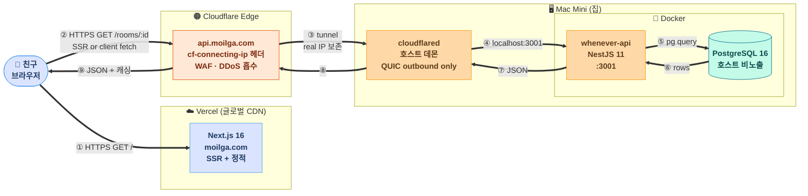

# 런타임 아키텍처 — 표준 박스 다이어그램

## 친구가 `moilga.com` 에 접속하면 어떤 일이 일어나는가

## 데이터 흐름 (수신·송신)

| # | 통신 | 비고 |
|---|---|---|
| ① | 브라우저 → Vercel CDN | HTTPS, 글로벌 PoP |
| ② | 브라우저(또는 Vercel SSR) → Cloudflare Edge | `Origin: https://moilga.com` 헤더 |
| ③ | Cloudflare Edge → cloudflared | **QUIC 터널 (outbound only)** · `cf-connecting-ip` 자동 추가 |
| ④ | cloudflared → API | `127.0.0.1:3001` Docker port |
| ⑤–⑦ | API ↔ PostgreSQL | Docker 내부 네트워크 |

## 보안 표면

| 표면 | 노출 |
|---|---|
| `moilga.com` | 공개 (Vercel) |
| `api.moilga.com` | 공개 (Cloudflare proxied) |
| 맥미니 인터넷 inbound | **없음** — cloudflared 가 outbound 만 함 |
| Postgres 포트 | **호스트 비노출** — Docker 내부 only |
| `.env.prod` | chmod 600, gitignored |

## 핵심 특성

- **실 IP 보존**: `cf-connecting-ip` 헤더가 백엔드까지 도달 → IP 기반 rate limit 정상 작동
- **DDoS 방어**: Cloudflare edge 가 흡수
- **재기동 0 중단**: cloudflared launchd 자동 재시작
- **글로벌 PoP**: Vercel + Cloudflare 둘 다 한국 노드 (icn) 가까움
