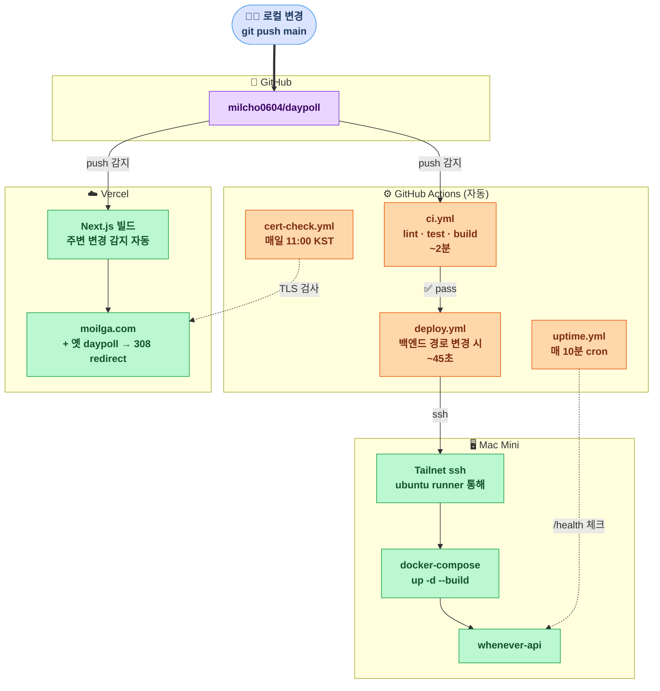

# 배포 아키텍처 — 표준 다이어그램

`git push main` 한 번에 무엇이 자동으로 일어나는가.



## 두 가지 별도 흐름

### 1. 프론트엔드 (Vercel)
```
git push → Vercel webhook → 빌드 → CDN 반영 (~3분)
```
**완전 자동**. 우리는 아무 GitHub Actions 안 씀 — Vercel 이 알아서.

### 2. 백엔드 (맥미니)
```
git push (백엔드 경로 변경) → ci.yml → deploy.yml
   → ubuntu runner → Tailnet ssh → 맥미니 docker compose up
```
**Tailscale Tailnet** 만 사용 — Funnel 은 안 씀 (Cloudflare Tunnel 으로 바뀌었음). 단순히 GitHub Actions runner 가 맥미니에 ssh 하기 위한 길.

### 3. 모니터링 (백그라운드)
| 워크플로 | 주기 | 어디 감시 |
|---|---|---|
| `uptime.yml` | 매 10분 | `api.moilga.com/health` 3-try |
| `cert-check.yml` | 매일 11:00 | TLS · TS_AUTHKEY 잔여일 |

→ 다운 / D-30 임박 → GitHub Issue 자동 → 본인 모바일 푸시.

## 사람 손이 닿는 시점
- ❌ Vercel 배포 — 자동
- ❌ 백엔드 배포 — 자동
- ❌ 모니터링 — 자동
- ✅ `.env.prod` 시크릿 회전 — 수동 (~분기 1회)
- ✅ Tailscale auth key 갱신 — 수동 (90일마다, 알림 옴)
